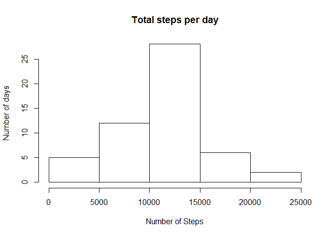
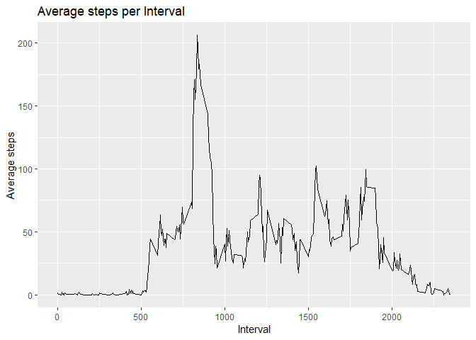
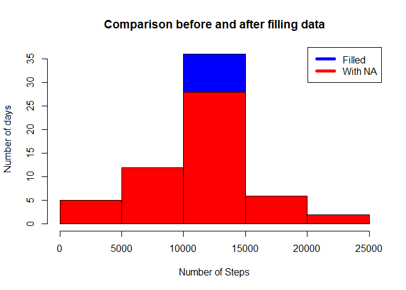
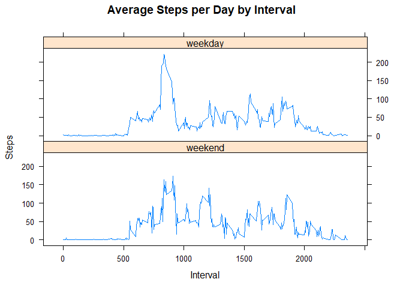

Author: Francisco José Martín Nieto
Date: September 2018

## Introduction

The goal of this project is to manipulate some activity tracker's data and learn how to write a report on 
R Markdown. This is a project from Reproducible Research course, in John's Hopkins' Data Scientist 
specialization in Coursera.


## Loading and preprocessing the data

As data is already on the GitHub project, first step is to unzip it and save it into a variable called "data". 
In order to manipulate lately, NA values will be removed and started data will be showed.


```r
unzip("activity.zip")
data <- read.csv("activity.csv")
data_filtered <- data[which(!is.na(data$steps)), ]
str(data_filtered)
```

```
## 'data.frame':	15264 obs. of  3 variables:
##  $ steps   : int  0 0 0 0 0 0 0 0 0 0 ...
##  $ date    : Factor w/ 61 levels "2012-10-01","2012-10-02",..: 2 2 2 2 2 2 2 2 2 2 ...
##  $ interval: int  0 5 10 15 20 25 30 35 40 45 ...
```

As date is written as a "Factor", it is going to be converted to date class:


```r
data_filtered$date <- as.POSIXct(data_filtered$date, format="%Y-%m-%d")
str(data_filtered)
```

```
## 'data.frame':	15264 obs. of  3 variables:
##  $ steps   : int  0 0 0 0 0 0 0 0 0 0 ...
##  $ date    : POSIXct, format: "2012-10-02" "2012-10-02" ...
##  $ interval: int  0 5 10 15 20 25 30 35 40 45 ...
```

Also, in last part data will be classified in weekday or weekend. Lets do this classification now:


```r
data_filtered$day <- weekdays(as.Date(data_filtered$date))
str(data_filtered)
```

```
## 'data.frame':	15264 obs. of  4 variables:
##  $ steps   : int  0 0 0 0 0 0 0 0 0 0 ...
##  $ date    : POSIXct, format: "2012-10-02" "2012-10-02" ...
##  $ interval: int  0 5 10 15 20 25 30 35 40 45 ...
##  $ day     : chr  "lunes" "lunes" "lunes" "lunes" ...
```

Now data is processed for analyze it.


## What is mean total number of steps taken per day?

First of all, total number of steps each day ("Total_Steps") must be calculated. In order to see it graphically, this 
Total_Steps is showed in an histogram:


```r
Total_Steps <- aggregate(steps ~ date, data_filtered, sum)
hist(Total_Steps$steps, main = paste("Total steps per day"), xlab="Number of Steps", ylab = "Number of days")
```

<!-- -->

As we see, there is a peak between 10k and 15k steps per day. Seeing that, it is a good idea to calculate both median 
and mean and see how many steps are walked in a day:


```r
mean(Total_Steps$steps)
```

```
## [1] 10766.19
```

```r
median(Total_Steps$steps)
```

```
## [1] 10765
```

Expert recommend to walk at least 8k steps every day, so this guy looks like a healty person!


## What is the average daily activity pattern?

Now we can see if there is a pattern in when this person walks during a day. In order to do it, we can just calculate
the mean of steps per interval ("Steps_Interval") and plot it:


```r
library(ggplot2)
Steps_Interval <- aggregate(steps ~ interval, data_filtered, mean)
g <- ggplot(Steps_Interval, aes(interval,steps))
g + geom_line() +  xlab("Interval") + ylab("Average steps") + ggtitle("Average steps per Interval")
```

<!-- -->

Seems like there is a pattern here. Let's look which is the interval where maximun amount of steps are concentrated:


```r
Steps_Interval[which.max(Steps_Interval$steps),1]
```

```
## [1] 835
```

```r
Steps_Interval[which.max(Steps_Interval$steps),2]
```

```
## [1] 206.1698
```
This is the interval we were looking for! And it contains more than 200 steps in 5 minutes! This person must be trying 
to catch a leaving bus...

## Imputing missing values

Previously we removed NA values, but we doesn't even look at how many of NA values are in original data. Let's look at 
it now:

```r
sum(is.na(data))
```

```
## [1] 2304
```
Instead of removing those entries, maybe we could have replaced them by the one-period average. We can also replace 
them for zeros, but it looks pretty unfair to this person, unless he were the whole day sleeping... Lets fill data now:


```r
data2 <- data
nas <- is.na(data2$steps)
data2$steps[nas] <- mean(data_filtered$steps)
sum(is.na(data2))
```

```
## [1] 0
```

Now every empty period is replaced by the one-period average! Let's see how much this replacement affect to the mean 
and median and per day!

First mean:


```r
Total_Steps_with_NA <- aggregate(steps ~ date, data, sum)
Total_Steps_filled <- aggregate(steps ~ date, data2, sum)
mean(Total_Steps_with_NA$steps)
```

```
## [1] 10766.19
```

```r
mean(Total_Steps_filled$steps)
```

```
## [1] 10766.19
```

And now median:


```r
median(Total_Steps_with_NA$steps)
```

```
## [1] 10765
```

```r
median(Total_Steps_filled$steps)
```

```
## [1] 10766.19
```

As we have filled NA values with one-period average, it is obvious mean will be the same! But we can see a dispersion
in median.

Maybe it will be more visual to see this in a histogram:


```r
hist(Total_Steps_filled$steps, main = paste("Comparison before and after filling data"), col="blue", xlab="Number of Steps", ylab = "Number of days")
hist(Total_Steps_with_NA$steps, col = "red",add=T)
legend("topright", c("Filled", "With NA"), col=c("blue", "red"), lwd=5)
```

<!-- -->


## Are there differences in activity patterns between weekdays and weekends?

Finally, let's look if this person moves more during weekdays or in weekends. At the start, we generate a column with 
the day of the week called "day". As I am from Spain, it generates to me a column with one of the day names in spanish
(monday -> lunes, tuesday -> martes, miércoles -> wednesday, etc). Now we can modify this column to generate a factor 
column with only weekday or weekend. If you are using RStudio in english, please change the names of the days if you 
are going to run the code!


```r
weekdays <- data_filtered$day %in% c("lunes","martes","miércoles","jueves","viernes")
data_filtered$day <- as.factor(weekdays)
levels(data_filtered$day) <- c("weekend","weekday")
head(data_filtered)
```

```
##     steps       date interval     day
## 289     0 2012-10-02        0 weekday
## 290     0 2012-10-02        5 weekday
## 291     0 2012-10-02       10 weekday
## 292     0 2012-10-02       15 weekday
## 293     0 2012-10-02       20 weekday
## 294     0 2012-10-02       25 weekday
```

Now we have this column indicating if a measure is in weekday or weekend. Let's do a panel plot like the README file 
comparing between both!


```r
library(lattice)
Total_Steps_day <- aggregate(steps ~ interval + day, data_filtered, mean)
xyplot(Total_Steps_day$steps ~ Total_Steps_day$interval|Total_Steps_day$day, main="Average Steps per Day by Interval",xlab="Interval", ylab="Steps",layout=c(1,2), type="l")
```

<!-- -->

